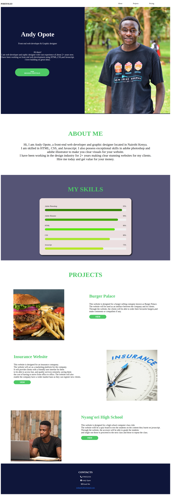

# Portfolio Landing Page

### By Joshua Andy Opote
### Table of contents
+ [Portfolio Landing Page](portfolio)
+ [Description](#Description)
+ [Installation](#Installation)
+ [Requirements](#Requiremnts)
+ [Technologies Used](#Technologies_used)
+ [Licence](#Licence)
### Portfolio Landing Page

### Description
This is a portfolio landing page designed for Andy Opote; a front end website developer marketing his skills.
### Installation
The website can be accesed via the link:https://andy3643.github.io/Portfolio-Landing/
### Requirements
* An internet enabled device such as computer, phone or tablet
* Active internet connection
* Web browser such as; chrome, firefox and opera mini.
## Technologies used
HTML to set out the page layout.
CSS to style the page components.

## Licence

MIT License

Copyright (c) [2022] [Joshua Andy]

Permission is hereby granted, free of charge, to any person obtaining a copy of this software and associated documentation files (the "Software"), to deal in the Software without restriction. including without limitation the rights.
Any persons willing to do modifications shall do so after consultation with the developer.
The above copyright notice and this permission notice shall be included in all copies or substantial portions of the Software.